# Mindfulness

Welcome to the mindfulness live link [Mindfulness](https://marceillo.github.io/mindfulness/index.html).

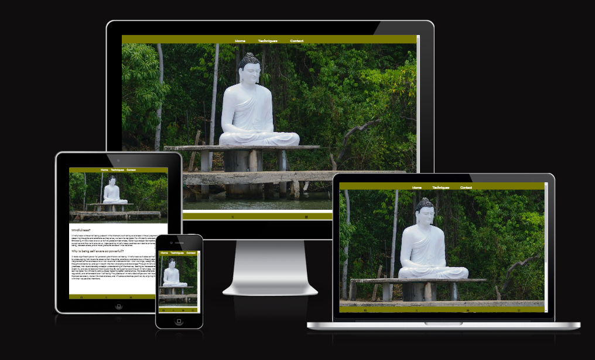

## Site Overview 

The site is about mindfulness, the ability of human beings to be fully present and aware of time and space around them. The site is small and straight to the point with a minimalistic feel. 

## Previous Repository 

One day into developing the site on Github the repository was not updating or synchronising with Gitpod.
After a couple of hours of trial and error, I had to delete the repository and start over. Luckily I made a copy of the basic code and was able not to lose more time in the process.

## Table of contents

1. [**Site Overview**](#site-overview)
2. [**Previous Repository**](#previous-repository)
3. [**User Experience**](#user-experience)
4. [**Planning stage**](#planning-stage)
   - [**_Site aims_**](#site-aims)
   - [**_Target audience_**](#target-audience)
   - [**_How I will achieve this:_**](#how-i-will-achieve-this)
   - [**_Wireframes_**](#wireframes)
   - [**_Color scheme_**](#color-scheme)
5. [**Elements used on all pages**](#elements-used-on-all-pages)
   - [**Header element**](#header-element)
   - [**_Navigation_**](#navigation)
   - [**Footer element**](#footer-element)
     - [**_Socials_**](#socials)
     - [**Typography**](#typography)
6. [**features**](#features)
   - [**Home**](#home)
   - [**Techniques**](#techniques)
   - [**Contact**](#contact)
7. [**Testing**](#testing)
8. [**Deployment**](#deployment)
9. [**Credits**](#credits)
   - [**_Honorable mentions_**](#honorable-mentions)
   - [**_General reference_**](#general-reference)
   - [**_Content_**](#content)
   - [**_Media_**](#media)

## User Experience 

### Planning stage 

### Site Aims: 

- The goal of this site was to provide some information about mindfulness.
- I wanted it to be minimalistic with a very simple but nice colour template.
- The minimalistic approach is always good leaving room for more features at a later stage.

### Target Audiences: 

- Users looking to improve their quality of life.
- Users who are looking within themselves.
- User who wants to live life to the best of their ability.

## Planning stage - How I will achieve this: 

- The home page provides the user with clear information on what mindfulness is about.
- The techniques page provides short meditation information and ways of incorporating mindfulness in your life.
- There is a contact page form that gives access to them to write what questions or information they need.
- The footer provides the user with contact details for them to get in touch via social media.
- The footer provides the user with social links so they can access more information on mindfulness.
- The footer also has no names but icons keeping true to the minimalistic view.

### Wireframes: 

I created wireframes for this project. Below are links to my site's mobile and desktop versions.

- Desktop wireframes:
  - 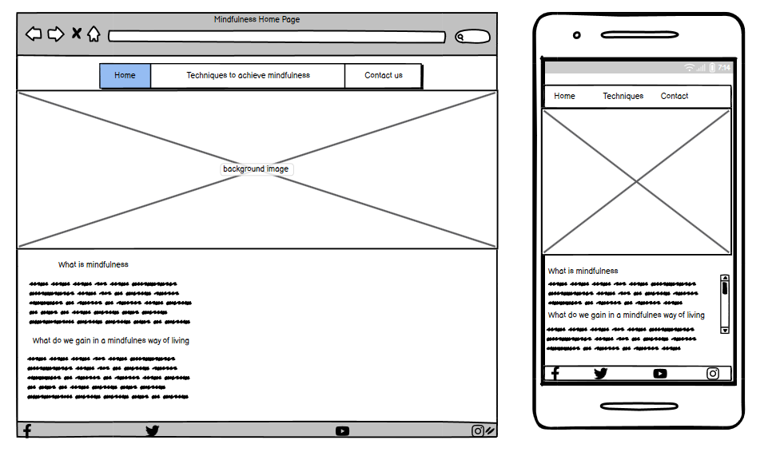
- Techniques wireframe:
  - 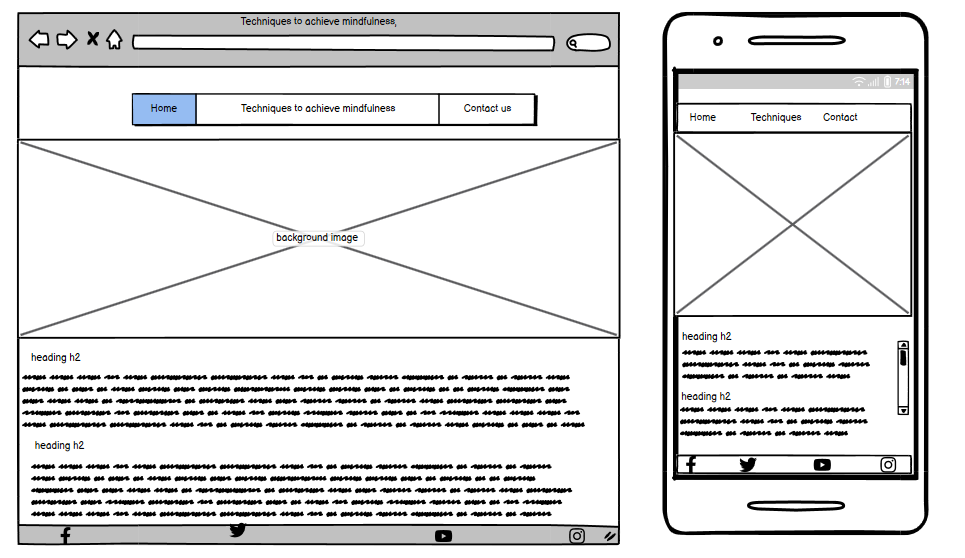-Contact wireframe:
- Contact page: 
  - 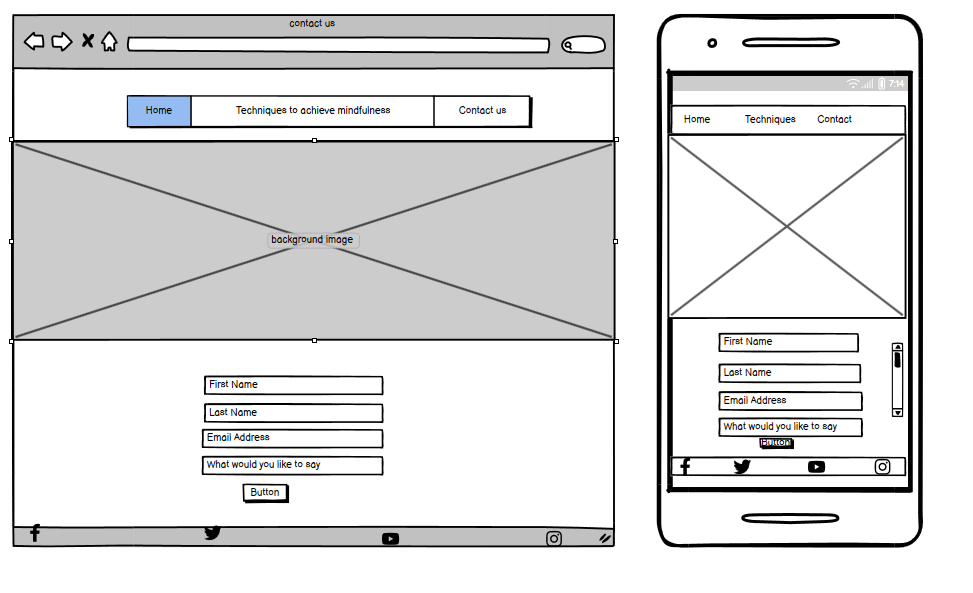
   

## Color Scheme: 

- I wanted colours  that match the hero's image as this would create a nice viewing experience.

## Elements used on all pages: 

## Header Element 

The header element is stuck to the top of the page, there were difficulties when it came to different screen sizes but those bugs were resolved.

### Navigation: 

##### Navigation for screen sizes larger than 786px:

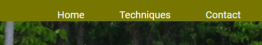 

##### Navigation for screen sizes smaller than 786px:

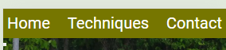

- The navigation appears on all pages.
- It contains links to home, techniques, contact 
- When the user is on a specific page, the link corresponding to their page will have the classes "active".

## Footer Element 

The footer element is at the very bottom of every page and has the social media icons sources from awsemfonts.

### Socials: 

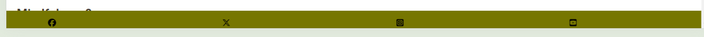

- There are four links in the footer to take the user to different media platforms.
- The platforms are Instagram, YouTube, Twitter and Facebook (There are no accounts for mindfulness only the links)

## Typography 

- The site uses the Roboto font.
It also uses Montserrat as a second font.
- The fonts were used as it is a popular font and fit well with the site.

## Features 

### Home: 

- This is the first view of the user and I wanted it to be short and sweet.
- The header is very simple and gives the user immediate access to the other pages.
- The section has two headings and two paragraphs
- It has an image of a Buddha meditating.

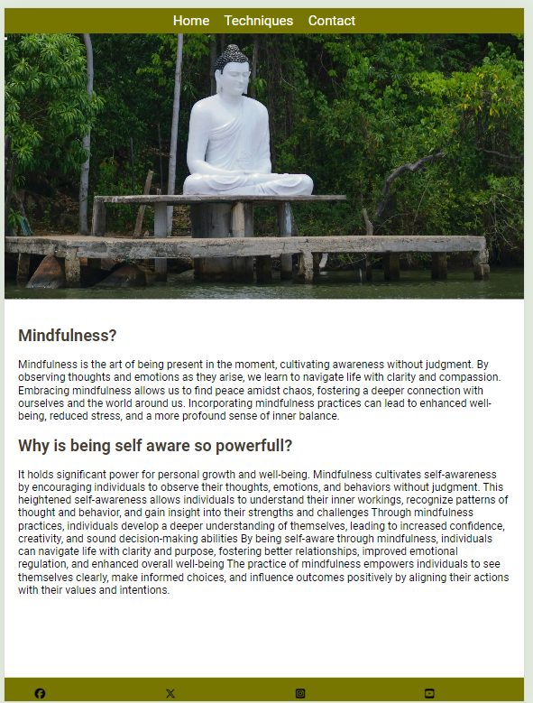

### Hero Section Content: 

- This section shows a Buddha sitting peacefully in the forest near a river meditating with eyes closed.
- This also has a hidden button describing  the image for the visually impaired.

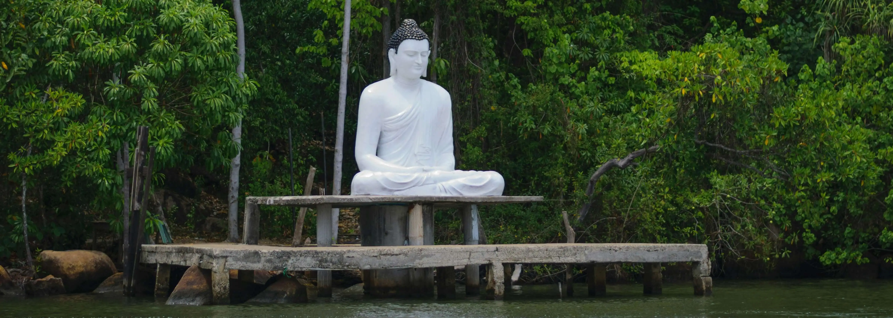

### Techniques: 

- There are exercises in this section for the user to try out and experience mindfulness.

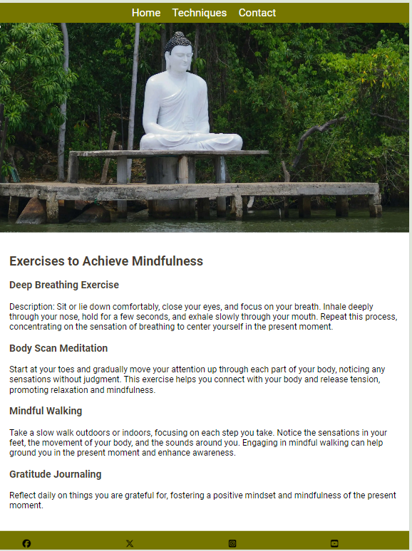

### Contact: 

- This section has a form that allows the user to contact the site and provide questions. 
- The form uses a code institute server which displays the information as typed once submitted.

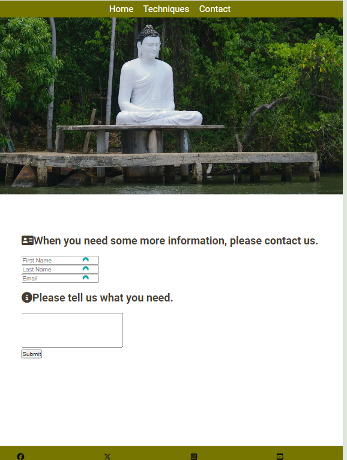

## Testing

### HTML validator results:

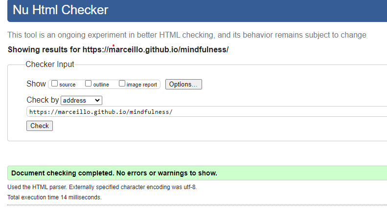

### CSS validator results:

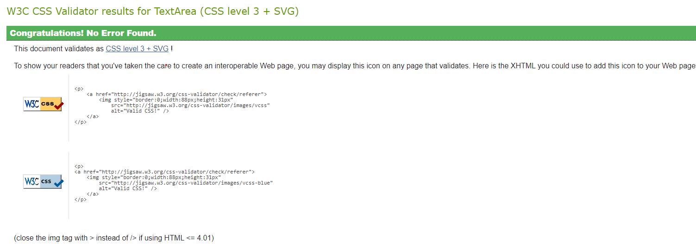

### Lighthouse desktop results:

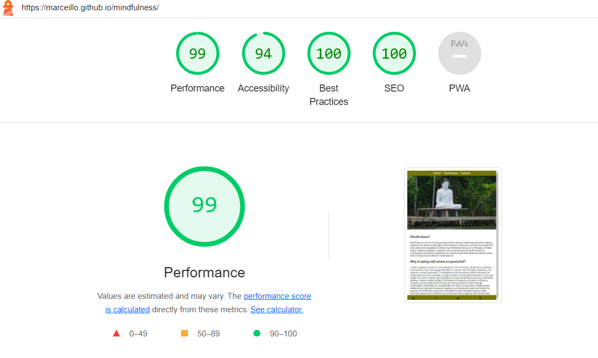

### Lighthouse mobile results:

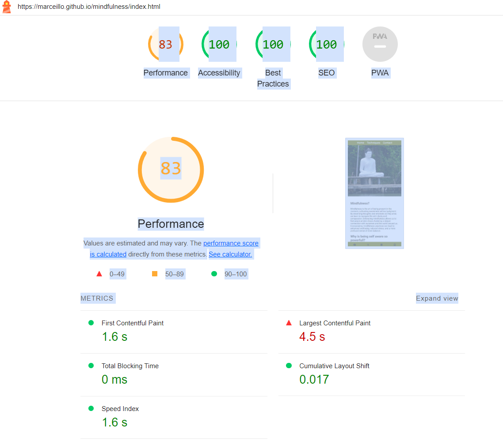

## Future Features 

* A 'Shop' section for projects that have been completed and are ready for purchasing.
    * This would incorporate an e-commerce platform and an enhanced gallery page.
* An option to livestream the workshop.
    * Particularly of interest to those whose projects are underway.
* Introduce swipe actions for use on mobile devices for the project sliders.

[Back to top](<#contents>)

# Technologies Used
* [HTML5](https://html.spec.whatwg.org/) - provides the content and structure for the website.
* [CSS](https://www.w3.org/Style/CSS/Overview.en.html) - provides the styling.
* [Balsamiq](https://balsamiq.com/wireframes/) - used to create the wireframes.
* [Gitpod](https://www.gitpod.io/#get-started) - used to deploy the website.
* [Github](https://github.com/) - used to host and edit the website.

[Back to top](<#contents>)

## Deployment 

Deployed the site on GitHub using the following procedure:

1. By clicking Repository/settings/pages 
2. Selecting the source tab then change to the main branch and save.
3. I then went to the deployed site and viewed the live site.
   
Fork the project:

Clone the project:

## Credits 

### Honorable mentions: 

This project could not have happened without the support of the following people listed in no particular order:

- David Bowers - My mentor David has been amazing in guiding me on how I can make an amazing project, if I get a distinction it is because of him.
- Patrick Hladun - Tester and advisor, gave me some amazing tips on how I can improve my site.
- Benjamin Schäfer - Tester and advisor, also gave me some amazing tips and pointed out bugs that I wouldn't have seen otherwise.
- Ayisha Sandiford - Tester and advisor, pointed out some bugs I did not notice, really helpful!

### General reference: 

The only piece of code I was inspired by and modified was the navigation toggle functionality from the love-running project.

### Content: 

- All contents for this project have been inspired by Chat.GPT, and modified for this project by me.
- All icons used are from [Font Awesome](https://fontawesome.com/)
- Fonts were imported from [Google fonts](https://fonts.google.com/)

### Media 

- Site:
  - Illustrations were taken from [Icons8](https://icons8.com/illustrations)
  - Eligibility form explainer video from [Fiverr](https://www.fiverr.com/) and it has been paid for and created by [Jump and Team](https://www.fiverr.com/jump_explainer/create-2d-animated-explainer-video-for-your-business?source=order_page_summary_gig_link_image&funnel=f84e587059164b9f98b4012a1686ac48)
  - Google Maps API by [Google](https://developers.google.com/maps/documentation/javascript/get-api-key)
- README:
  - Color grid contrast tool - [Eightshapes](https://contrast-grid.eightshapes.com/?version=1.1.0&background-colors=&foreground-colors=%23FFFFFF%2C%20White%0D%0A%23F2F2F2%0D%0A%23DDDDDD%0D%0A%23CCCCCC%0D%0A%23888888%0D%0A%23404040%2C%20Charcoal%0D%0A%23000000%2C%20Black%0D%0A%232F78C5%2C%20Effective%20on%20Extremes%0D%0A%230F60B6%2C%20Effective%20on%20Lights%0D%0A%23398EEA%2C%20Ineffective%0D%0A&es-color-form__tile-size=compact&es-color-form__show-contrast=aaa&es-color-form__show-contrast=aa&es-color-form__show-contrast=aa18&es-color-form__show-contrast=dnp)
  - File compression tool - [Tinypng](https://tinypng.com/)
  - File converter tool - [Pixelied](https://pixelied.com/convert/png-converter/png-to-webp)
  - README structure - Inspired by David Bower's [project](https://github.com/dnlbowers/modern-buddhism/blob/main/README.md)
