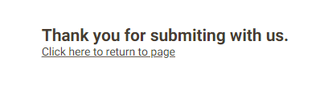
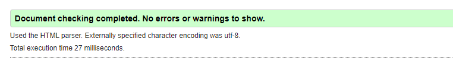
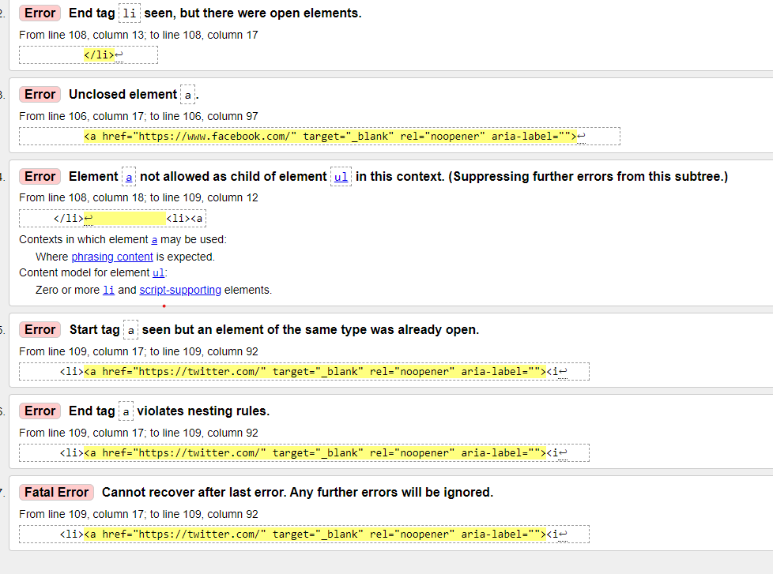
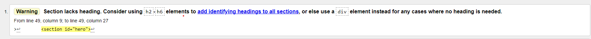

# Mindfulness

Welcome to the mindfulness live link [Mindfulness](https://marceillo.github.io/mindfulness/index.html).

## Site Overview 

The site is about mindfulness, the ability of human beings to be fully present and aware of time and space around them. The site is small and straight to the point with a minimalistic feel. 

## Previous Repository 

One day into developing the site on Github the repository was not updating or synchronising with Gitpod.
After several hours of trial and error, I had to delete the repository and start over. Luckily I made a copy of the basic code and was able not to lose more time in the process.

## Table of contents 

1. [**Site Overview**](#site-overview)
2. [**Previous Repository**](#previous-repository)
3. [**User Experience**](#user-experience)
4. [**Planning stage**](#planning-stage)
   - [**_Site aims_**](#site-aims)
   - [**_Target audience_**](#target-audience)
   - [**_How I will achieve this:_**](#how-i-will-achieve-this)
   - [**_Wireframes_**](#wireframes)
   - [**_Color scheme_**](#color-scheme)
5. [**Features**](#features)
6. [**Elements used on all pages**](#elements-used-on-all-pages)
   - [**Header element**](#header-element)
   - [**_Navigation_**](#navigation)
   - [**Footer element**](#footer-element)
   - [**_Socials_**](#socials)
   - [**Typography**](#typography)
   - [**Home**](#home)
   - [**Techniques**](#techniques)
   - [**Contact**](#contact)
7. [**Testing**](#testing)
8. [**Deployment**](#deployment)
9. [**Credits**](#credits)
   - [**_Honorable mentions_**](#honorable-mentions)
   - [**_General reference_**](#general-reference)
   - [**_Content_**](#content)
   - [**_Media_**](#media)

## User Experience 

### Planning stage 

### Site Aims: 

- The goal of this site was to provide some information about mindfulness.
- I wanted it to be minimalistic with a very simple but nice colour template.
- The minimalistic approach is always good leaving room for more features at a later stage.

### Target Audiences: 

- Users looking to improve their quality of life.
- Users who are looking within themselves.
- User who wants to live life to the best of their ability.

## Planning stage - How I will achieve this: 

- The home page provides the user with clear information on what mindfulness is about.
- The techniques page provides short meditation information and ways of incorporating mindfulness in your life.
- There is a contact page form that gives access to them to write what questions or information they need.
- The footer provides the user with contact details for them to get in touch via social media.
- The footer provides the user with social links so they can access more information on mindfulness.
- The footer also has no names but icons keeping true to the minimalistic view.

### Wireframes: 

I created wireframes for this project. Below are links to my site's mobile and desktop versions.

- Desktop wireframes:
  - 
- Techniques wireframe:
  - -Contact wireframe:
- Contact page: 
  - 
   

## Color Scheme: 

- I wanted colours  that match the hero's image as this would create a nice viewing experience.

## Features 

## Elements used on all pages: 

## Header Element 

The header element is stuck to the top of the page, there were difficulties when it came to different screen sizes but those bugs were resolved.

### Navigation: 

##### Navigation for screen sizes larger than 786px:

 

##### Navigation for screen sizes smaller than 786px:

- The navigation appears on all pages.
- It contains links to home, techniques, contact 
- When the user is on a specific page, the link corresponding to their page will have the classes "active".

## Footer Element 

The footer element is at the very bottom of every page and has the social media icons sources from awsemfonts.

### Socials: 

- There are four links in the footer to take the user to different media platforms.
- The platforms are Instagram, YouTube, Twitter and Facebook (There are no accounts for mindfulness only the links)

## Typography 

- The site uses the Roboto font.
It also uses Montserrat as a second font.
- The fonts were used as it is a popular font and fit well with the site.

### Home: 

- This is the first view of the user and I wanted it to be short and sweet.
- The header is very simple and gives the user immediate access to the other pages.
- The section has two headings and two paragraphs
- It has an image of a Buddha meditating.

### Hero Section Content: 

- This section shows a Buddha sitting peacefully in the forest near a river meditating with eyes closed.
- This also has a hidden button describing  the image for the visually impaired.

### Techniques: 

- There are exercises in this section for the user to try out and experience mindfulness.

### Contact: 

- This section has a form that allows the user to contact the site and provide questions. 
- I originally built  The form using a code institute server which displays the submitted information.
- It now has an HTML page that appears with a message thanking the user for submitting after pressing the submit button. With a link to go back to the contact page.

## Testing

### HTML validator results:

#### Home page:

#### Techniques page:

#### Contact page:

#### Errors Found:

#### Warnings found:

#### Fixes implemented

- The warnings were about having a headings tag in the section. I created hidden headings and this resolved the problem.
- The errors where the anchor tag did not have a closing tag although it should be self-closing. To solve this I created a closing tag.

### CSS validator results:

### Responsiveness Test:

* The responsive design was done manually with Chrome development tools built into the browser.

|        | Galaxy Fold | Galaxy S8+ | iPhone 12pro | iPad mini  | iPad pro | Display <1024px | Display >1025px
|--------|---------|-----------|----------|------|----------|-----------------|-----------------|
| Render | pass    | pass      | pass     | pass | pass     | pass            | pass            |
| Images | pass    | pass      | pass     | pass | pass     | pass            | pass            |
| Links  | pass    | pass      | pass     | pass | pass     | pass            | pass            |

### Browser Compatibility

The mindfulness site was tested on the following browsers with no visible issues for the user. 
- Google Chrome
- Mozilla Firefox
- Microsoft Edge
- Brave 

### Lighthouse desktop results:

### Lighthouse mobile results:

### Known Bugs

- The hero image sometimes moves into the header page using margins and padding to help with this.
- Also, the hero image gave performance issues due to size I to crop, reformat, and improve performance.
- The Paragraph on the home page on some viewports was not able to scroll a line break to assist with this problem.

### Future Features 

- I would like to see the site with more content such as video, audio, and reading material.
- Add a 30-day program that users can follow each day to track their progress as they go along.
- A blog page with book recommendations and event calendars.

[Back to top](<#contents>)

# Technologies Used
- [HTML5](https://dev.w3.org/html5/spec-LC/introduction.html) - provides the content and structure for the website.
- [CSS](https://www.w3.org/Style/CSS/Overview.en.html) - provides the styling.
- [Balsamiq](https://balsamiq.com/wireframes/) - used to create the wireframes.
- [Gitpod](https://www.gitpod.io/#get-started) - used to deploy the website.
- [Github](https://github.com/) - used to host and edit the website.
- [Am I responsive](https://ui.dev/amiresponsive) - This tool tests the responsiveness of the site and provides an image used in the beginning of the document. 
- [Jigsaw validator](https://jigsaw.w3.org/css-validator/) - used to look for errors and none standard css code.
- [W3C validator](https://validator.w3.org/) - used to look for errors and none standard html code.
- [Optimizing background image](https://tinypng.com/) - used to optimize image for websites.
- [Converting tool](https://convertio.co/image-converter/) - used to convert jpeg to webp file format.
- Google Chrome's lighthouse for performance and accessibility tests for mobile and desktop modes.
  
## Deployment 

Deployed the site on GitHub using the following procedure:

1. By clicking Repository/settings/pages 
2. Selecting the source tab then change to the main branch and save.
3. I then went to the deployed site and viewed the live site.
   
[Fork the project]([https://dev.w3.org/html5/spec-LC/introduction.html](https://docs.github.com/en/pull-requests/collaborating-with-pull-requests/working-with-forks/fork-a-repo)

[Clone the project]([https://github.com/](https://docs.github.com/en/repositories/creating-and-managing-repositories/cloning-a-repository) 

## Credits 

### General reference: 

Special thank you to my mentor Precious Ijege for his ideas and criticism.  
I found inspiration from my love of running a project for the hero section.
What was nice about the Love Running project was the practical experience.

### Content: 

- Due to time frames I used [perplexity](https://www.perplexity.ai/search/Find-the-drinks-vvwgjCJ4SO2hwVp07WtSKA)
- Used icons from [Font Awesome](https://fontawesome.com/)
- Fonts found and imported from [Google fonts](https://fonts.google.com/)

### Media 

- Site:
  - [background image](https://www.pexels.com/photo/buddha-statue-grayscale-photo-714644/) - background image
  - [Stackoverflow](https://stackoverflow.com/) - used for research.
  - [W3schools](https://www.w3schools.com/) - used for research.
  - [Html guidebook](https://htmlandcssguidebook.com/)  - used for research.
  - [Inspiration for forms](https://www.youtube.com/watch?v=HiHHvTcHiEk&list=PL4cUxeGkcC9g5_p_BVUGWykHfqx6bb7qK)
  - 
   
 
    
- README:
   - README structure - Inspired by Ilyas Olgun [project](https://github.com/ilyasolgun11/paws-play-pp1/blob/main/docs/TESTING.md)

  

 [Back to top](<#table-of-contents>)
